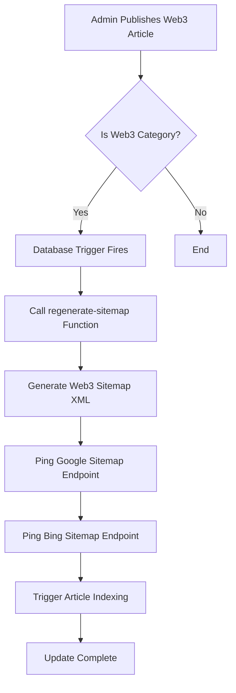

# Web3 Sitemap Automation Setup

## Overview

Automatic sitemap regeneration and search engine submission system for Web3 content. When Web3 articles are published or updated, the system automatically:

1. ✅ Regenerates the Web3 sitemap with latest content
2. ✅ Includes articles, learning paths, code snippets, and static pages
3. ✅ Submits sitemap to Google and Bing for immediate indexing
4. ✅ Triggers individual article indexing via Google Search Console

## Architecture

### Components

1. **Database Trigger** (`trigger_web3_sitemap_on_article_publish`)
   - Monitors Web3 article publications
   - Automatically calls regeneration endpoint
   - Runs asynchronously to not block article publishing

2. **Edge Functions**
   - `regenerate-sitemap`: Orchestrates sitemap regeneration
   - `web3-sitemap`: Generates Web3-specific sitemap XML
   - Integrates with `google-index-now` for article indexing

3. **API Endpoint** (`api/web3-sitemap.xml.js`)
   - Serves the sitemap to crawlers
   - Cached for 1 hour for performance
   - Dynamically fetches from database

## Features

### Dynamic Content Included

✅ **Web3 Homepage** (`/web3forindia`)
- Priority: 1.0
- Change frequency: Daily

✅ **Web3 Dashboard** (`/web3forindia/dashboard`)
- Priority: 0.8
- Change frequency: Weekly

✅ **Web3 About Page** (`/web3forindia/about`)
- Priority: 0.7
- Change frequency: Monthly

✅ **Web3 Code Playground** (`/web3forindia/playground`)
- Priority: 0.7
- Change frequency: Weekly

✅ **Category Pages**
- All Web3 subcategories
- Priority: 0.9
- Change frequency: Weekly

✅ **Article Pages**
- All published Web3 articles
- Priority: 0.8
- Change frequency: Monthly

✅ **Learning Paths**
- Individual learning path pages
- Priority: 0.8
- Change frequency: Monthly

✅ **Code Snippets** (Top 100)
- Individual snippet pages
- Priority: 0.6
- Change frequency: Weekly

## How It Works

### Automatic Workflow



### Manual Workflow

You can also trigger regeneration manually:

```bash
# Regenerate Web3 sitemap only
curl -X POST https://tadcyglvsjycpgsjkywj.supabase.co/functions/v1/regenerate-sitemap \
  -H "Content-Type: application/json" \
  -d '{"sitemapType": "web3", "submitToGSC": true}'

# Regenerate all sitemaps
curl -X POST https://tadcyglvsjycpgsjkywj.supabase.co/functions/v1/regenerate-sitemap \
  -H "Content-Type: application/json" \
  -d '{"sitemapType": "all", "submitToGSC": true}'
```

## Configuration

### Search Engine Submission

The system automatically pings:

**Google:**
```
https://www.google.com/ping?sitemap=https://www.thebulletinbriefs.in/api/web3-sitemap.xml
```

**Bing:**
```
https://www.bing.com/ping?sitemap=https://www.thebulletinbriefs.in/api/web3-sitemap.xml
```

### Sitemap URLs

All sitemaps are automatically submitted:

- Main: `https://www.thebulletinbriefs.in/api/sitemap.xml`
- Web3: `https://www.thebulletinbriefs.in/api/web3-sitemap.xml`
- Tools: `https://www.thebulletinbriefs.in/api/sitemap-tools.xml`
- News: `https://www.thebulletinbriefs.in/api/news-sitemap.xml`
- Web Stories: `https://www.thebulletinbriefs.in/api/web-stories-sitemap.xml`

## Database Schema

### Trigger Function

```sql
CREATE OR REPLACE FUNCTION trigger_web3_sitemap_regeneration()
RETURNS TRIGGER
LANGUAGE plpgsql
SECURITY DEFINER
SET search_path = public
AS $$
DECLARE
  is_web3_article boolean := false;
BEGIN
  -- Check if this is a Web3 article
  SELECT EXISTS (
    SELECT 1 FROM categories c
    WHERE c.id = NEW.category_id
    AND (c.slug = 'web3forindia' OR c.parent_id IN (
      SELECT id FROM categories WHERE slug = 'web3forindia'
    ))
  ) INTO is_web3_article;

  -- Trigger regeneration if Web3 article published
  IF is_web3_article AND NEW.published = true THEN
    PERFORM net.http_post(
      url := 'https://tadcyglvsjycpgsjkywj.supabase.co/functions/v1/regenerate-sitemap',
      headers := jsonb_build_object(
        'Content-Type', 'application/json',
        'Authorization', 'Bearer ' || current_setting('app.supabase_service_role_key', true)
      ),
      body := jsonb_build_object(
        'articleId', NEW.id::text,
        'sitemapType', 'web3',
        'submitToGSC', true
      )
    );
  END IF;
  
  RETURN NEW;
END;
$$;
```

## Monitoring & Debugging

### Check Trigger Status

```sql
-- View trigger details
SELECT * FROM pg_trigger 
WHERE tgname = 'trigger_web3_sitemap_on_article_publish';

-- Check last regeneration logs
SELECT * FROM seo_automation_logs 
WHERE service_name = 'regenerate-sitemap'
ORDER BY created_at DESC 
LIMIT 10;
```

### Edge Function Logs

View logs in Supabase Dashboard:
- [Regenerate Sitemap Logs](https://supabase.com/dashboard/project/tadcyglvsjycpgsjkywj/functions/regenerate-sitemap/logs)
- [Web3 Sitemap Logs](https://supabase.com/dashboard/project/tadcyglvsjycpgsjkywj/functions/web3-sitemap/logs)

### Test Sitemap

```bash
# View current sitemap
curl https://www.thebulletinbriefs.in/api/web3-sitemap.xml

# Validate sitemap structure
xmllint --format https://www.thebulletinbriefs.in/api/web3-sitemap.xml
```

## Performance

- **Sitemap Generation**: ~2-5 seconds
- **Search Engine Ping**: ~1-2 seconds per engine
- **Total Time**: ~5-10 seconds
- **Cache**: 1 hour (3600 seconds)

The process runs asynchronously, so article publishing is not delayed.

## Benefits

✅ **Instant Indexing**: New content indexed within minutes
✅ **SEO Boost**: Fresh content signals to search engines
✅ **Zero Manual Work**: Fully automated process
✅ **Multi-Engine**: Covers Google, Bing, and other crawlers
✅ **Comprehensive**: Includes all Web3 content types
✅ **Performance**: Cached and optimized for speed

## Troubleshooting

### Sitemap Not Updating

1. Check if trigger is enabled:
   ```sql
   SELECT tgenabled FROM pg_trigger 
   WHERE tgname = 'trigger_web3_sitemap_on_article_publish';
   ```

2. Manually trigger regeneration:
   ```bash
   curl -X POST https://tadcyglvsjycpgsjkywj.supabase.co/functions/v1/regenerate-sitemap \
     -H "Content-Type: application/json" \
     -d '{"sitemapType": "web3", "submitToGSC": true}'
   ```

3. Check edge function logs for errors

### Articles Missing from Sitemap

Ensure articles meet criteria:
- Published status: `published = true`
- Category: Must be `web3forindia` or subcategory
- Recent cache: Wait 1 hour or clear CDN cache

## Google Search Console Integration

### Verify Sitemaps Submitted

1. Go to [Google Search Console](https://search.google.com/search-console)
2. Navigate to **Sitemaps** section
3. Check submission status and indexed URLs
4. View coverage reports

### Monitor Indexing

- Check **Coverage** report for newly published articles
- View **Performance** for search traffic
- Review **Enhancements** for structured data

## Future Enhancements

- [ ] Add video tutorials to sitemap
- [ ] Include quiz pages
- [ ] Add community/discussion pages
- [ ] Support for multi-language sitemaps
- [ ] Real-time indexing via IndexNow API

## Related Documentation

- [Web Stories Automation](./WEB_STORIES_AUTOMATION_SETUP.md)
- [SEO Automation](./SEO_AUTOMATION_SETUP.md)
- [Indexing Setup](./INDEXING_SETUP.md)
